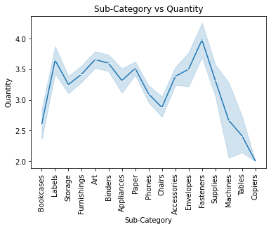
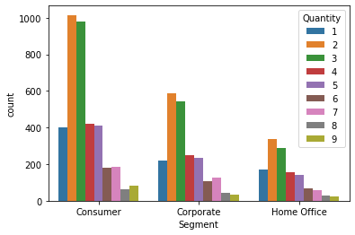
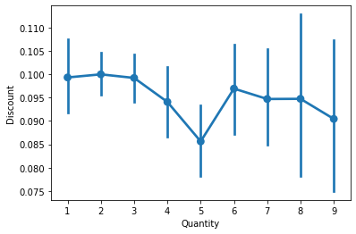
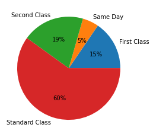

# Ex-08-Data-Visualization-

## AIM
To Perform Data Visualization on a complex dataset and save the data to a file. 

# Explanation
Data visualization is the graphical representation of information and data. By using visual elements like charts, graphs, and maps, data visualization tools provide an accessible way to see and understand trends, outliers, and patterns in data.

# ALGORITHM
### STEP 1
Read the given Data
### STEP 2
Clean the Data Set using Data Cleaning Process
### STEP 3
Apply Feature generation and selection techniques to all the features of the data set
### STEP 4
Apply data visualization techniques to identify the patterns of the data.

# CODE:
```
import pandas as pd
import numpy as np
import matplotlib.pyplot as plt
import seaborn as sns
df=pd.read_csv("Superstore.csv",encoding='windows-1252')
df

df.drop("Row ID",axis=1,inplace=True)
df.drop("Order Date",axis=1,inplace=True)
df.drop("Order ID",axis=1,inplace=True)
df.drop("Ship Date",axis=1,inplace=True)
df.drop("Customer ID",axis=1,inplace=True)
df.drop("Customer Name",axis=1,inplace=True)
df.drop("Country",axis=1,inplace=True)
df.drop("Product ID",axis=1,inplace=True)
df.drop("Postal Code",axis=1,inplace=True)
df

df.isnull().sum()

df.boxplot()

cols = ["Sales","Quantity","Discount","Profit"]
Q1 = df[cols].quantile(0.25)
Q3 = df[cols].quantile(0.75)
IQR = Q3 - Q1
df = df[~((df[cols] < (Q1 - 1.5 * IQR)) |(df[cols] > (Q3 + 1.5 * IQR))).any(axis=1)]
df

df.boxplot()

#line plot 
sns.lineplot(x="Category",y="Profit",data=df,marker='o')
plt.title("Category vs Profit")
plt.xticks(rotation = 45)
plt.show()

sns.lineplot(x="Sub-Category",y="Profit",data=df,marker='h')
plt.title("Sub-Category vs Profit")
plt.xticks(rotation = 90)
plt.show()

sns.lineplot(x="Sub-Category",y="Quantity",data=df,marker='_')
plt.title("Sub-Category vs Quantity")
plt.xticks(rotation = 90)
plt.show()

sns.lineplot(x="Region",y="Sales",data=df,marker=',')
plt.title("Region vs Sales")
plt.xticks(rotation = 45)
plt.show()

sns.lineplot(x="Ship Mode",y="Sales",data=df,marker='.')
plt.title("Ship Mode vs Sales")
plt.xticks(rotation = 45)
plt.show()

sns.lineplot(x="Discount",y="Profit",data=df,marker='|')
plt.title("Discount vs Profit")
plt.xticks(rotation = 360)
plt.show()

plt.figure(figsize=(12,7))
sns.barplot(x="Sub-Category",y="Profit",data=df,palette='rainbow')
plt.title("Sub-Category vs Profit")
plt.xticks(rotation = 90)
plt.show()

plt.figure(figsize=(12,7))
sns.barplot(x="State",y="Sales",data=df,palette='bright')
plt.title("State vs Sales")
plt.xticks(rotation = 90)
plt.show()

plt.figure(figsize=(25,8))
sns.barplot(x="State",y="Sales",hue="Region",data=df)
plt.title("State vs Sales based on Region")
plt.xticks(rotation = 90)
plt.show()

#Histogram
sns.histplot(data = df,x = 'Category',hue='Quantity')
plt.xticks(rotation = 360)
plt.show()

sns.histplot(data = df,x = 'Sub-Category',hue='Category')
plt.xticks(rotation = 90)
plt.show()

sns.histplot(data = df,x = 'Region',hue='Ship Mode')
plt.xticks(rotation = 360)
plt.show()

plt.hist(data = df,x = 'Sales')
plt.show()

#Count plot
sns.countplot(x ='Ship Mode', data = df,hue = 'Category')

sns.countplot(x ='Category', data = df,hue='Discount')

sns.countplot(x="Segment",data=df,hue="Quantity")

sns.countplot(x ='Category', data = df,hue='Discount')

sns.countplot(x ='Discount', data = df)

#KDE plot
sns.kdeplot(x="Profit", data = df,hue="Category")

sns.kdeplot(x="Profit", data = df,hue="Ship Mode")

sns.kdeplot(x="Sales", data = df,hue="Region")

sns.kdeplot(x="Discount", data = df,hue="Category")

#violin plot
sns.violinplot(x="Sales",data=df)

sns.violinplot(x="Profit",y="Category",data=df)

sns.violinplot(x="Profit",y="Ship Mode",data=df)

sns.violinplot(x="Quantity",y="Category",data=df)

#Point Plot
sns.pointplot(x=df["Quantity"],y=df["Discount"])

sns.pointplot(x=df["Sales"],y=df["Sub-Category"])

#Pie Chart
df.groupby(['Category']).sum().plot(kind='pie', y='Discount',figsize=(6,10),pctdistance=1.7,labeldistance=1.2)
df.groupby(['Sub-Category']).sum().plot(kind='pie', y='Profit',figsize=(10,10),pctdistance=1.7,labeldistance=1.2)
df.groupby(['Region']).sum().plot(kind='pie', y='Sales',figsize=(6,9),pctdistance=1.7,labeldistance=1.2)
df.groupby(['Ship Mode']).sum().plot(kind='pie', y='Quantity',figsize=(8,11),pctdistance=1.7,labeldistance=1.2)

df1=df.groupby(by=["Category"]).sum()
labels=[]
for i in df1.index:
    labels.append(i)  
plt.figure(figsize=(8,8))
colors = sns.color_palette('pastel')
plt.pie(df1["Profit"],colors = colors,labels=labels, autopct = '%0.0f%%')
plt.show()

df1=df.groupby(by=["Ship Mode"]).sum()
labels=[]
for i in df1.index:
    labels.append(i)
colors=sns.color_palette("bright")
plt.pie(df1["Sales"],labels=labels,autopct="%0.0f%%")
plt.show()

#HeatMap
df4=df.copy()

#encoding
from sklearn.preprocessing import LabelEncoder,OrdinalEncoder,OneHotEncoder
le=LabelEncoder()
ohe=OneHotEncoder
oe=OrdinalEncoder()

df4["Ship Mode"]=oe.fit_transform(df[["Ship Mode"]])
df4["Segment"]=oe.fit_transform(df[["Segment"]])
df4["City"]=le.fit_transform(df[["City"]])
df4["State"]=le.fit_transform(df[["State"]])
df4['Region'] = oe.fit_transform(df[['Region']])
df4["Category"]=oe.fit_transform(df[["Category"]])
df4["Sub-Category"]=le.fit_transform(df[["Sub-Category"]])
df4["Product Name"]=oe.fit_transform(df[["Product Name"]])

from sklearn.preprocessing import RobustScaler
sc=RobustScaler()
df5=pd.DataFrame(sc.fit_transform(df4),columns=['Ship Mode', 'Segment', 'City', 'State','Region','Category','Sub-Category','Product Name','Sales','Quantity','Discount','Profit'])

plt.subplots(figsize=(12,7))
sns.heatmap(df5.corr(),cmap="rainbow",annot=True)
plt.show()
```
# OUPUT:


 
## Outliers:


## Line Plot:
 
 
 

## Bar Plot:
 
 
 


## Histogram:
 
 

## Count Plot:
 
 

## KDE Plot:
 
 

## Violin Plot:
 
 

## Point Plot:
 

## Pie Chart:
 
 
 

## Heatmap:


# Result:
Hence,Data Visualization is applied on the complex dataset using libraries like Seaborn and Matplotlib successfully and the data is saved to file.